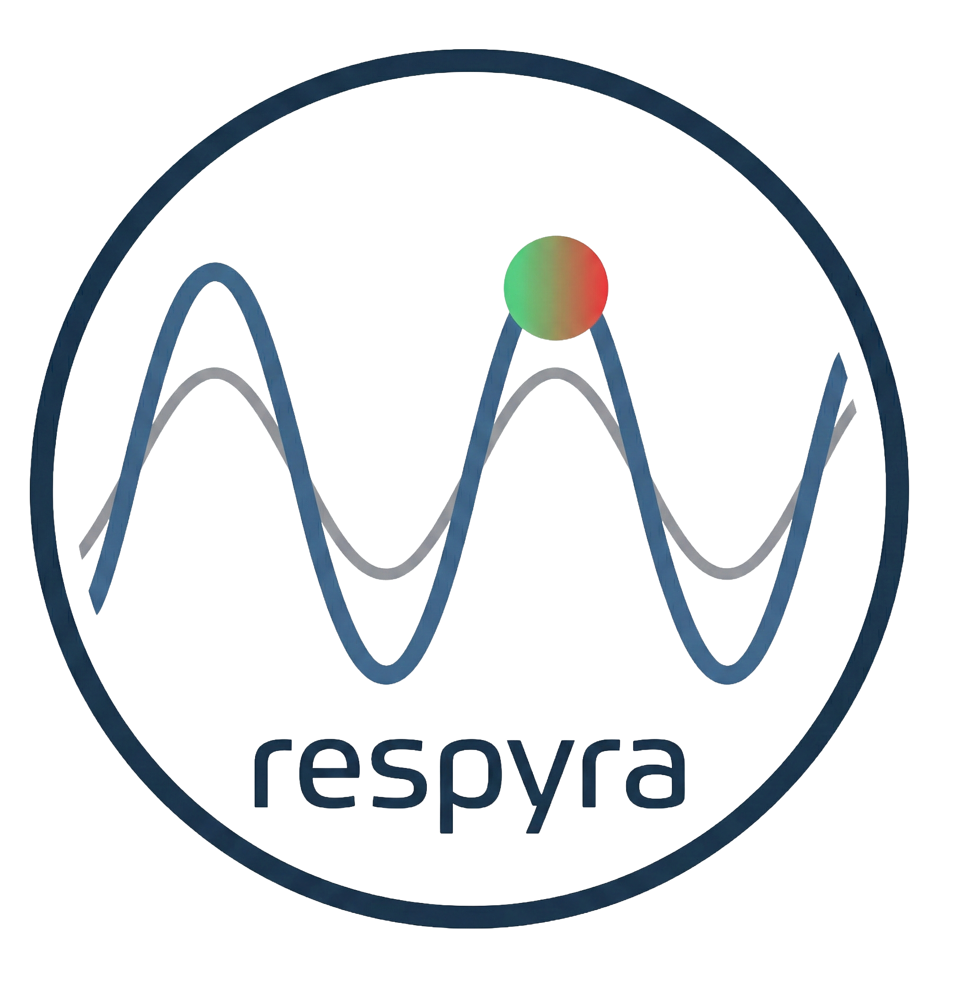
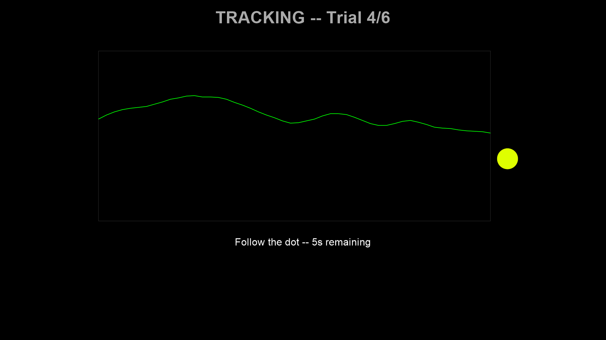

<p align="center">
  
</p>

<h1 align="center">respyra</h1>

<p align="center">
  <strong>A general-purpose respiratory motor control tracking toolbox for interoception research</strong>
</p>

<p align="center">
  <a href="https://pypi.org/project/respyra/"></a>
  <a href="https://embodied-computation-group.github.io/respyra/"></a>
  <a href="https://github.com/embodied-computation-group/respyra/blob/main/LICENSE"></a>
  <a href="https://www.python.org/downloads/"></a>
</p>

---

respyra is a Python toolbox that integrates a [Vernier Go Direct Respiration Belt](https://www.vernier.com/product/go-direct-respiration-belt/) (GDX-RB) with [PsychoPy](https://www.psychopy.org/) to enable real-time respiratory motor control tracking experiments. Participants follow a sinusoidal target dot with their breathing while receiving continuous visual biofeedback. The toolbox supports configurable experimental conditions including multi-frequency target waveforms and visuomotor perturbations (visual gain manipulation).

**[Full documentation](https://embodied-computation-group.github.io/respyra/)** | **[PyPI](https://pypi.org/project/respyra/)** | **[Paper](https://github.com/embodied-computation-group/respyra/tree/main/paper)**

## Task Schematic


## Task Screenshots

| Range Calibration | Baseline |
|:-:|:-:|
|  |  |

| Countdown | Tracking (good) | Tracking (poor) |
|:-:|:-:|:-:|
|  |  |  |

## Installation

### From PyPI (recommended)

```bash
pip install respyra
```

For post-session visualization (adds pandas and matplotlib):

```bash
pip install "respyra[vis]"
```

### Development install

```bash
git clone https://github.com/embodied-computation-group/respyra.git
cd respyra
```

Create a virtual environment with Python 3.10:

```bash
# Windows (with Python Launcher)
py -3.10 -m venv .venv
.venv\Scripts\activate

# macOS / Linux
python3.10 -m venv .venv
source .venv/bin/activate
```

Install in editable mode:

```bash
pip install -e ".[vis]"
```

### Requirements

- **Python 3.10** -- PsychoPy does not yet support 3.11+
- **Vernier Go Direct Respiration Belt** (GDX-RB) -- required for hardware experiments; display demos run without a belt

## Quick start

Run a no-hardware display demo to verify PsychoPy is working:

```bash
python -m respyra.demos.demo_display
```

With a belt connected, run the full experiment:

```bash
respyra-task
```

See the [full documentation](https://embodied-computation-group.github.io/respyra/) for detailed installation, quickstart, and user guide.

## Running the experiment

```bash
python -m respyra.scripts.breath_tracking_task
# or, after pip install:
respyra-task
```

### Session flow

1. **Belt connection** -- BLE with automatic USB fallback (connects before PsychoPy to avoid Windows COM conflicts)
2. **Participant info dialog** -- enter participant ID and session number
3. **Range calibration** (15 s) -- comfortable deep breaths to establish breathing range, with percentile-based outlier rejection and sensor saturation detection
4. **Trial loop** (per condition x N reps):
   - **Baseline** (10 s) -- breathe naturally
   - **Countdown** (3 s) -- target dot blends from current position into the target waveform
   - **Tracking** (30 s) -- follow the sinusoidal target dot with breathing
   - **Feedback** -- mean absolute tracking error for the trial
5. **Data saved** to `data/` as CSV (one row per sample, flushed incrementally)

### Experimental conditions

Conditions are defined in `respyra/configs/breath_tracking.py` using composable frequency segments:

| Condition | Pattern | Feedback gain |
|---|---|---|
| `slow_steady` | 3 cycles at 0.1 Hz (30 s) | 1.0 (veridical) |
| `mixed_rhythm` | 3 cycles at 0.1 Hz + 1 cycle at 0.3 Hz | 1.0 (veridical) |
| `perturbed_slow` | 3 cycles at 0.1 Hz (30 s) | 1.5 (amplified trace) |

The **feedback gain** perturbation multiplies the displayed breathing trace around the participant's center, similar to cursor rotation in visuomotor reaching studies. The target dot, tracking error, and color feedback remain based on the true (unperturbed) signal -- only the visual trace is distorted.

### Visual feedback

The target dot changes color based on real-time tracking error:

- **Graded mode** (default) -- continuous green (good) to yellow to red (poor) using HSV interpolation
- **Binary mode** -- yellow/red threshold
- **Trinary mode** -- yellow/orange/red with two thresholds

## Post-session visualization

```bash
python -m respyra.utils.vis.plot_session data/sub-01_ses-001_2026-02-24.csv
# or, after pip install:
respyra-plot data/sub-01_ses-001_2026-02-24.csv
```

Generates a 6-panel summary figure saved as `{csv_stem}_summary.png`:

1. Full session force trace with target overlay
2. Signed tracking error per trial
3. Per-trial mean absolute error (bar chart)
4. Error distribution by condition (box plot)
5. Baseline calibration stability across trials
6. Summary statistics (MAE, RMSE, per-condition breakdown)

## Project structure

```
respyra/
  core/             Reusable modules
    breath_belt.py    Non-blocking belt I/O (threaded reader + queue)
    display.py        PsychoPy window, SignalTrace waveform renderer
    data_logger.py    Incremental CSV logging with crash resilience
    events.py         Keyboard input helpers
    target_generator.py  Sinusoidal target waveform from segment definitions
    gdx/              Vernier gdx wrapper (from godirect-examples, not on PyPI)
  configs/          Experiment parameters (no magic numbers in scripts)
  scripts/          Runnable experiment sessions
  demos/            Standalone single-feature test scripts
  utils/vis/        Post-session visualization
docs/               Sphinx documentation source
media/              Stimulus assets and icons
data/               Session output (gitignored)
```

## Demos

```bash
python -m respyra.demos.demo_belt_connection   # Test belt connectivity (terminal only)
python -m respyra.demos.demo_display           # PsychoPy display with synthetic data
python -m respyra.demos.demo_threaded_belt     # Threaded belt queue-draining pattern
```

## Documentation

Full documentation is available at **[embodied-computation-group.github.io/respyra](https://embodied-computation-group.github.io/respyra/)**, including:

- [Installation guide](https://embodied-computation-group.github.io/respyra/installation.html) with platform-specific notes
- [Quick start](https://embodied-computation-group.github.io/respyra/quickstart.html) tutorial
- [User guide](https://embodied-computation-group.github.io/respyra/userguide.html) with detailed experiment configuration
- [API reference](https://embodied-computation-group.github.io/respyra/api/index.html) generated from source docstrings
- [Troubleshooting](https://embodied-computation-group.github.io/respyra/troubleshooting.html) for common issues

## Platform notes

**Windows BLE**: The Vernier belt's BLE scanner (Bleak) requires COM in MTA mode on the main thread. PsychoPy sets COM to STA on import. The framework handles this by connecting the belt *before* importing PsychoPy.

**Linux**: Requires udev rules for USB access. See the [installation guide](https://embodied-computation-group.github.io/respyra/installation.html#linux).

**macOS**: Works with both BLE and USB out of the box.

## License

[MIT](LICENSE)
