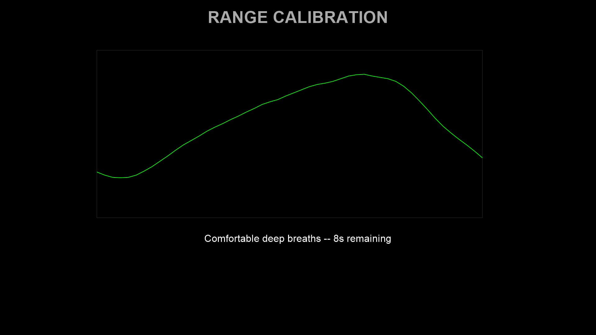
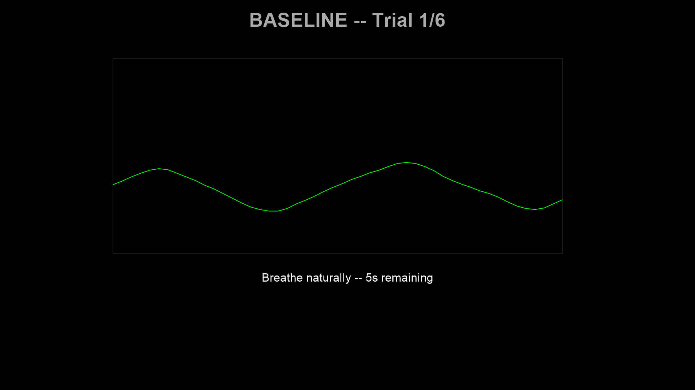
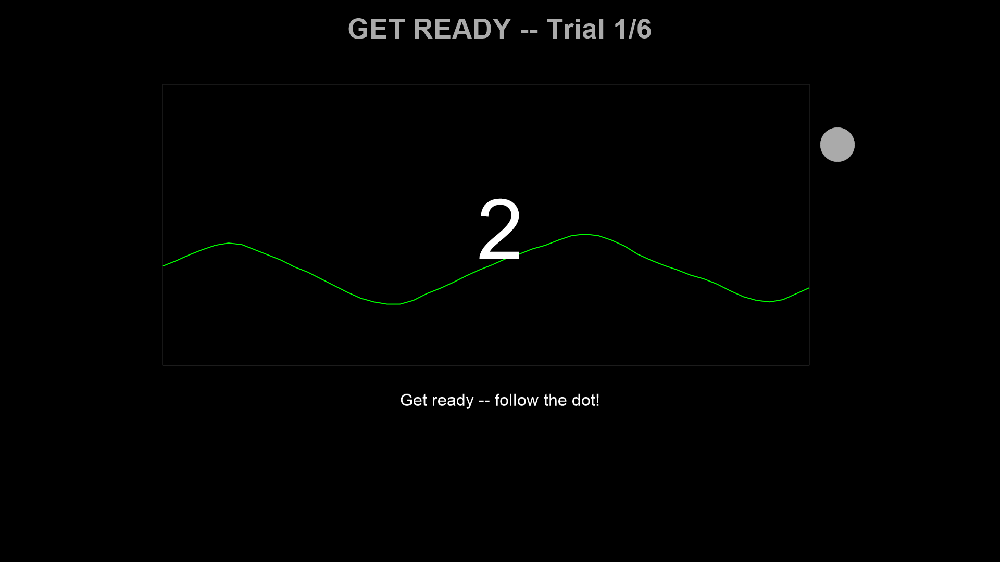
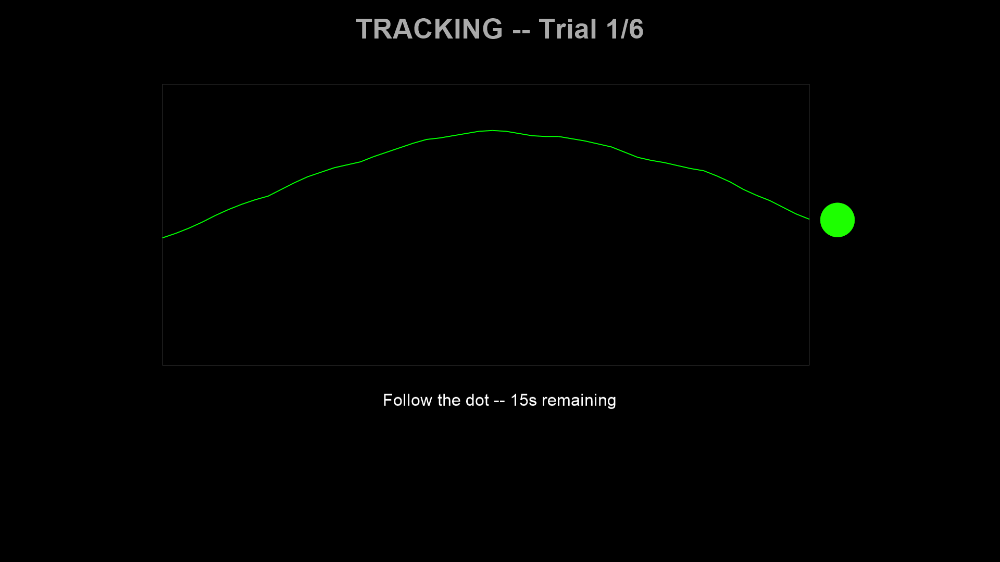

# User Guide

This guide covers the full experiment workflow, configuration options, and data output format.

## Session flow

A full experiment session proceeds through the following stages:

### 1. Belt connection

The script connects to the Vernier Go Direct Respiration Belt via BLE (with automatic USB fallback). Connection happens **before** PsychoPy is imported to avoid a Windows COM threading conflict.

### 2. Participant info dialog

A PsychoPy dialog collects participant ID and session number. These are embedded in the output filename.

### 3. Range calibration (15 seconds)

The participant takes several comfortable deep breaths. The system records the breathing range and uses it to scale the target waveform to the participant's individual amplitude. Percentile-based outlier rejection (5th–95th percentile by default) excludes signal artefacts. A saturation warning is shown if force readings hit the sensor limits (0 N or 40 N).



### 4. Trial loop

Each trial has three phases:

**Baseline** (10 s) — Breathe naturally. The system records the participant's resting breathing center for that trial.



**Countdown** (3 s) — The target dot blends from the participant's current respiratory position into the sinusoidal target waveform. A large 3-2-1 counter is displayed.



**Tracking** (30 s) — Follow the target dot with breathing. The dot changes color based on tracking error. The live breathing trace is shown scrolling from left to right.



After each trial, a feedback screen displays the mean absolute tracking error.

### 5. Data output

Session data is saved incrementally to a CSV file in `data/`, with one row per sample. The filename encodes the participant ID, session, and timestamp (e.g., `sub-01_ses-001_2026-02-24_143022.csv`).

## Configuration

Experiments are configured using {class}`~respyra.configs.experiment_config.ExperimentConfig`, a structured dataclass that groups all parameters into sub-configs. Run experiments with the `--config` flag:

```bash
# Built-in config by short name
respyra-task --config demo
respyra-task --config validation_study

# Custom config file
respyra-task --config experiments/my_study.py
```

Custom configs start from a base and override fields with {func}`dataclasses.replace`:

```python
from dataclasses import replace
from defaults import CONFIG as _BASE

CONFIG = replace(
    _BASE,
    name="My Study",
    timing=replace(_BASE.timing, tracking_duration_sec=60.0),
    display=replace(_BASE.display, fullscr=True),
)
```

See {doc}`creating_experiments` for the full tutorial, including condition presets, counterbalanced designs, and custom experiment flows.

### Key parameter groups

| Sub-config | Controls |
|---|---|
| `BeltConfig` | Connection type, sampling rate, sensor channels |
| `DisplayConfig` | Window mode, monitor dimensions, coordinate units |
| `TimingConfig` | Phase durations (calibration, baseline, countdown, tracking) |
| `TraceConfig` | Waveform display area, color, scroll duration |
| `DotConfig` | Target dot appearance, feedback mode, error thresholds |
| `RangeCalConfig` | Calibration scaling, percentile clipping, saturation limits |
| `TrialConfig` | Conditions list, repetitions, ordering, counterbalancing function |

### Condition presets

The {mod}`respyra.configs.presets` module provides factory functions for common paradigms:

```python
from respyra.configs.presets import slow_steady, perturbed_slow, mixed_rhythm

easy = slow_steady(freq_hz=0.1, n_cycles=3)
perturbed = perturbed_slow(feedback_gain=2.0)
mixed = mixed_rhythm(freq_slow=0.1, freq_fast=0.25)
```

## Defining conditions

Conditions are built from composable segments using `SegmentDef` and `ConditionDef`:

```python
from respyra.core.target_generator import SegmentDef, ConditionDef

# 3 cycles at 0.1 Hz = 30 seconds of slow sinusoidal breathing
SLOW_STEADY = ConditionDef('slow_steady', [SegmentDef(0.1, 3)])

# Multi-frequency: 3 slow cycles + 1 fast cycle
MIXED_RHYTHM = ConditionDef('mixed_rhythm', [
    SegmentDef(0.1, 3),   # 30 s at 0.1 Hz
    SegmentDef(0.3, 1),   # 3.3 s at 0.3 Hz
])

# Same waveform as slow_steady but with amplified visual feedback
PERTURBED_SLOW = ConditionDef(
    'perturbed_slow',
    [SegmentDef(0.1, 3)],
    feedback_gain=1.5,  # trace is 1.5x amplified around center
)
```

Using integer cycle counts per segment ensures phase continuity at boundaries — the waveform loops seamlessly.

## Visual feedback modes

The target dot's color provides real-time tracking error feedback. Three modes are available (set via `DotConfig.feedback_mode`):

**Graded** (default) — Continuous green → yellow → red color mapping using HSV interpolation. Error 0 = pure green; error ≥ `graded_max_error_n` (3.0 N) = pure red.

**Binary** — Two-color threshold: yellow (good, error ≤ `error_threshold_n`) or red (poor).

**Trinary** — Three-color: yellow (good, ≤ `error_threshold_n`), orange (moderate, ≤ `error_threshold_mid_n`), red (poor).

## Visuomotor perturbation

The feedback gain parameter multiplies the **displayed** breathing trace around the participant's center:

```
f_display = center + gain × (f_actual − center)
```

- `gain = 1.0` — veridical feedback (what you breathe is what you see)
- `gain > 1.0` — amplified: small breathing excursions look larger on screen
- `gain < 1.0` — attenuated: large breathing excursions look smaller

The **target dot** position follows the true target waveform, but the **dot color feedback** reflects the *visual* (compensated) error — the discrepancy between the target and the gain-perturbed trace. Only the waveform trace is visually distorted. This creates a sensorimotor mismatch analogous to cursor rotation in visuomotor reaching studies.

## Data output format

The session CSV contains one row per sample with these columns:

| Column | Type | Description |
|---|---|---|
| `timestamp` | float | Time in seconds (from experiment clock, resets per phase) |
| `frame` | int | Frame counter |
| `force_n` | float | Force reading in Newtons from the respiration belt |
| `target_force` | float | Target force value (tracking phase only) |
| `error` | float | Signed error: target − actual (tracking phase only) |
| `compensated_error` | float | Signed error: target − displayed force, i.e. after gain (tracking only) |
| `phase` | str | `range_cal`, `baseline`, `countdown`, or `tracking` |
| `condition` | str | Condition name (e.g., `slow_steady`) |
| `trial_num` | int | Trial number (1-indexed) |
| `feedback_gain` | float | Active feedback gain for this trial |

## Post-session visualization

Generate a 6-panel summary figure:

```bash
respyra-plot data/sub-01_ses-001_2026-02-24.csv
```

The six panels show:
1. Full session force trace with target overlay and phase shading
2. Signed tracking error per trial
3. Per-trial mean absolute error (bar chart by condition)
4. Error distribution by condition (box plot with trial-level scatter)
5. Baseline calibration stability across trials (center ± amplitude)
6. Summary statistics (MAE, RMSE, per-condition breakdown)

Use `--no-show` to save the PNG without displaying interactively. Process multiple files with `respyra-plot data/*.csv --no-show`.
