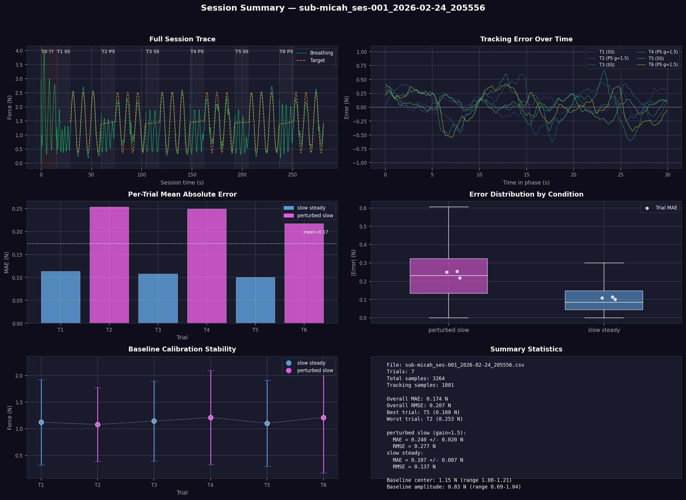

# Visualization

respyra includes post-session visualization tools for evaluating data quality and participant performance. This page walks through the output and explains how to interpret each panel.

## Session summary figure

After running an experiment, generate a 6-panel summary figure:

```bash
respyra-plot data/sub-01_ses-001_2026-02-24.csv
```

Or process multiple files at once:

```bash
respyra-plot data/*.csv --no-show
```

The figure is saved as `{csv_stem}_summary.png` alongside the CSV.

### Example output



The figure has a dark theme for easy viewing and is organized into six panels described below.

---

## Panel 1: Full Session Trace (top left)

Shows the complete session from start to finish. The **green line** is the participant's raw breathing signal (force in Newtons from the respiration belt). The **orange dashed line** is the sinusoidal target waveform (visible only during tracking phases).

**Background shading** indicates session phases:
- Dark warm brown — range calibration (session start)
- Dark indigo — baseline (natural breathing)
- Dark teal — countdown (3-2-1)
- Near-black — tracking (active task)

**Trial labels** at the top of each trial segment show the trial number, condition abbreviation (SS = slow steady, PS = perturbed slow), and feedback gain if not 1.0 (e.g., `g=1.5`).

**What to look for:**
- Consistent breathing amplitude across trials (no progressive fatigue or drift)
- Breathing signal tracking the target waveform during tracking phases
- Smooth transitions between phases

## Panel 2: Tracking Error Over Time (top right)

Shows the **signed tracking error** (target − actual force) for each trial's tracking phase, plotted against time within the phase. Each trial is a separate colored line.

The **horizontal dashed lines** at ±1.0 N mark a reference threshold. Zero error means perfect tracking.

**What to look for:**
- Errors centered around zero indicate unbiased tracking
- Systematic positive or negative drift suggests the participant is consistently breathing too shallow or too deep relative to the target
- Error reduction over time within a trial indicates within-trial learning
- Larger error variance in perturbed conditions (gain ≠ 1.0) is expected

## Panel 3: Per-Trial Mean Absolute Error (middle left)

A **bar chart** showing the mean absolute error (MAE) in Newtons for each trial. Bars are color-coded by condition (blue = slow steady, magenta = perturbed slow). The **dashed white line** shows the overall mean across all trials.

**What to look for:**
- Lower MAE = better tracking performance
- Perturbed conditions typically show higher MAE than veridical conditions
- Decreasing MAE across trials of the same condition suggests learning
- An unusually high single trial may indicate a distraction or belt slip

## Panel 4: Error Distribution by Condition (middle right)

**Box plots** showing the distribution of absolute error across all samples for each condition. White dots overlaid are the per-trial MAE values (from Panel 3), providing a trial-level view on top of the sample-level distribution.

**What to look for:**
- Median error (white line in the box) should be relatively low for good tracking
- Wide boxes or long whiskers indicate high variability in tracking precision
- Condition differences: perturbed conditions should show larger errors
- Per-trial dots clustered together indicate consistent performance; spread-out dots suggest variable performance across trials

## Panel 5: Baseline Calibration Stability (bottom left)

Shows the **center ± amplitude** of the participant's natural breathing during each trial's baseline phase. The center (dot) is the midpoint between minimum and maximum force, and the error bars extend to the breathing range extremes. A **dashed white line** connects the centers to reveal drift.

**What to look for:**
- Stable centers across trials mean the belt hasn't shifted and the participant's resting breathing is consistent
- Drifting centers may indicate belt slippage, postural changes, or progressive relaxation/fatigue
- Consistent amplitude (error bar length) indicates stable breathing depth
- If centers drift substantially, the per-trial baseline recalibration compensates for this in the tracking target

## Panel 6: Summary Statistics (bottom right)

A text panel with key metrics:

- **File** and trial count
- **Overall MAE and RMSE** averaged across all trials
- **Best and worst trials** by MAE
- **Per-condition breakdown** with MAE ± SD and RMSE, including feedback gain for perturbed conditions
- **Baseline calibration summary** — center and amplitude ranges across trials

## Programmatic use

The visualization functions can also be used in Python scripts or notebooks:

```python
from respyra.utils.vis.plot_session import load_session, plot_session

df = load_session("data/sub-01_ses-001_2026-02-24.csv")
fig = plot_session(df, "data/sub-01_ses-001_2026-02-24.csv")
fig.savefig("my_summary.png", dpi=150, facecolor=fig.get_facecolor())
```

Individual analysis functions are also available:

```python
from respyra.utils.vis.plot_session import compute_trial_stats, compute_baseline_cal

stats = compute_trial_stats(df)   # per-trial MAE, RMSE, sample counts
cal = compute_baseline_cal(df)    # per-trial baseline center and amplitude
```

See the {doc}`API reference <api/plot_session>` for full documentation of all functions.
